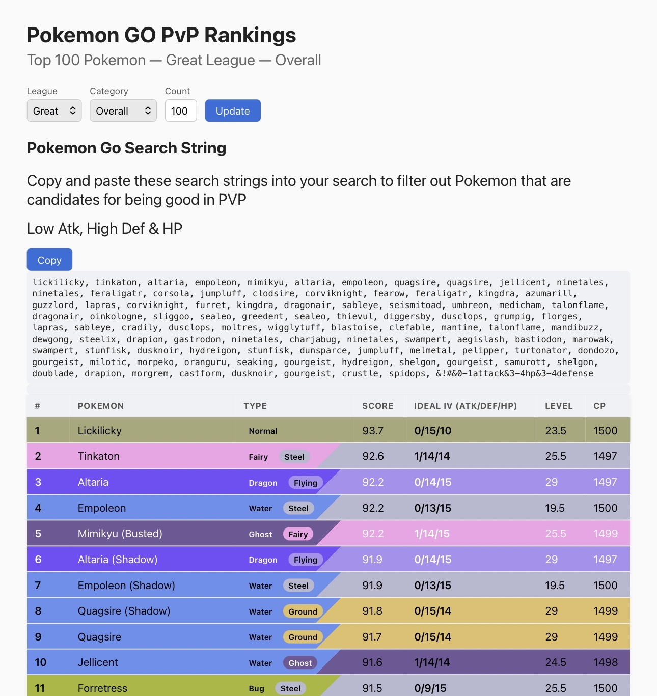
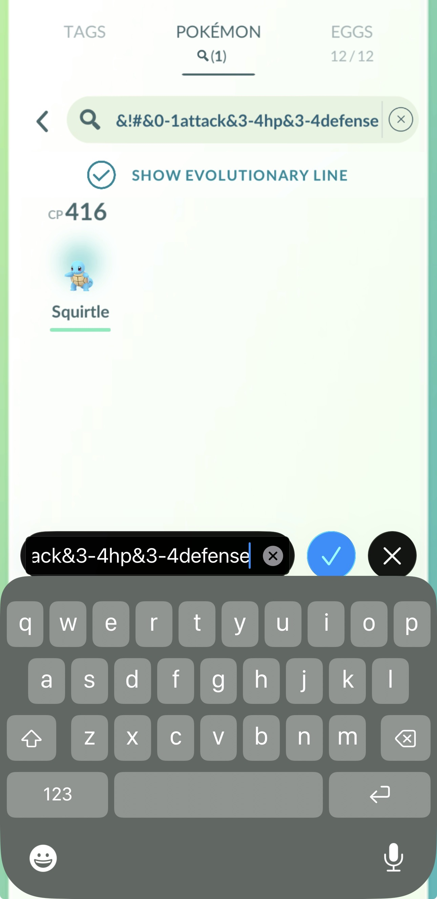
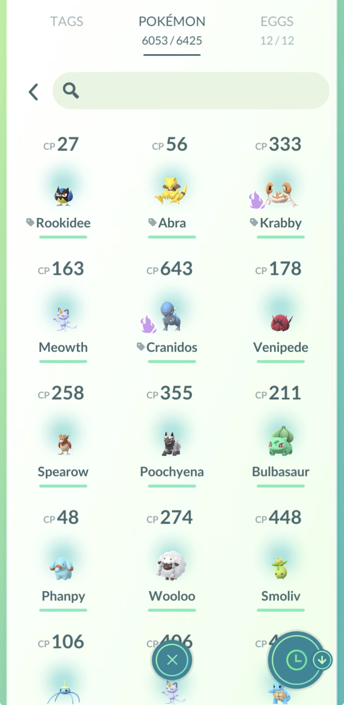
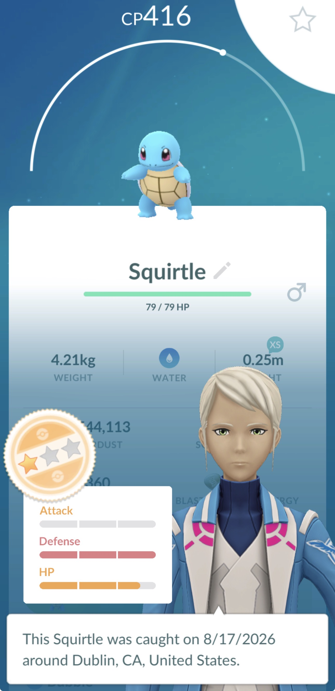
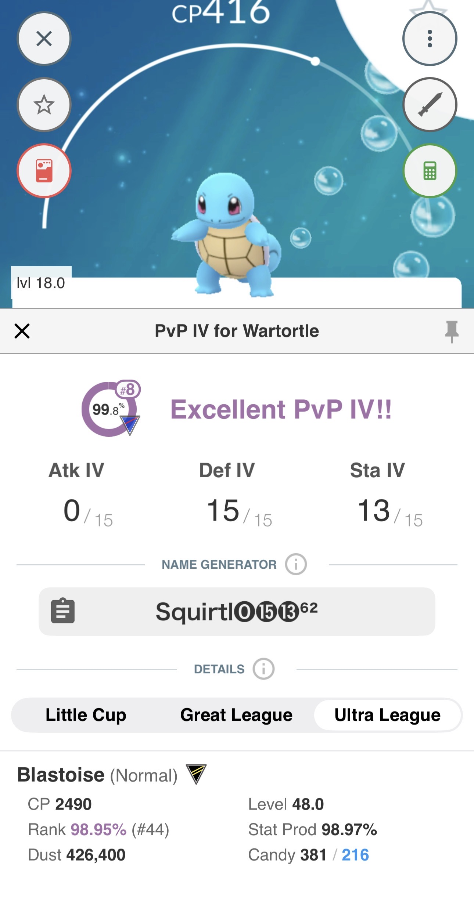

# pokemon-go-pvp

This app helps facilitate finding meta-relevant pokémon for PvP in your current storage. It takes data from [pvpoke.com](https://www.pvpoke.com) (updated every 6 hours) and curates a common delimited list of pokémon along with ideal IV ranges that you can copy from the browser and paste into the Pokémon Go's storage search bar. 

## Demo

1. Go to [pokemongopvp.com](https://www.pokemongopvp.com) and choose from the dropdowns and text boxes what you are looking for. Following options are currently available:

### League
* Great
* Ultra
* Master
### Category
* Overall
* Leads
* Closers
* Attackers
* Switches
* Chargers
### Count
* Number of pokémon you want listed, defaulting with the top 100.



2. Click Update if you have changed the options from the defaults and up to 2 lists will be shown where applicable:
* Pokémon with ideal IVs being low attack, high defense and stamina
* Pokémon with ideal IVs being high attack, defense and stamina

A copy button will be rendered that will copy the text string below into your clipboard.

3. Go into the Pokémon Go app and go to your pokémon storage. Copy the text string into the search bar which should filter out the PvP pokémon you are searching for.




4. Here we have one ideal pokémon to review for PvP, Squirtle



5. Cross referencing this Squirtle with an app like [Poké Genie](https://apps.apple.com/us/app/poke-genie-remote-raid-iv-pvp/id1143920524) will confirm this Squirtle does indeed have an ideal IV for PvP ranking in the 99th percentile!



## Tips
Assuming you want to tag/review top 100 overall pokémon used in PvP, my recommendation for using the app is as follows on a daily, weekly, or monthly basis depending on how active you are in the game:

* Note: I would also check the "Show Evolutionary Line" box while searching in case you have an ideal pokemon for battle that is yet to be evolved.

* Search for Master League pokémon and tag all pokémon for review (I create a 'ML Review' tag, along with 'UL Review', and 'GL Review').
* Search for Ultra League pokémon and tag all pokémon for review.
* Search for Great League pokémon and tag all pokémon for review.
* Go back to searching for Ultra League pokémon, remove the filter for IVs (e.g. 01-attack&3-4hp&3-4defense), tag them for transfer/trades.
* GO back to searching for Great League pokémon, remove the filter for IVs and tag them for transfer/trades.

* With the pokémon that are meta-relevant in PvP but don't have the ideal IVs, you have 2 good options outside of simply transferring them on the spot:
  * Trade with another trainer with low friendship levels to reroll the IVs and see if they get a better pokémon for PvP. Ideally they are also trading you their "bad IV, PvP pokémon" too! Also a chance to obtain more candy/candy XL while doing trades.
  * Flag these pokémon to transfer on spotlight hour days where you get double-transfer candy, if needed for evolutions/power-ups.


## Project Structure

```
pokemon-go-pvp/
├── app/          Flask web app -- rankings, IV calculation, search-string generation
├── ansible/      Infrastructure automation -- droplet provisioning, hardening, deployment
└── .github/      CI/CD workflow (test + auto-deploy on merge to main)
```

`app/` and `ansible/` are deliberately independent -- each has its own Python virtual environment and dependency list, since one runs on your machine (or the droplet), and the other only runs on your machine (or a CI runner) to *manage* the droplet.


## Running the App Locally

```
cd app/
python3 -m venv .pgo
source .pgo/bin/activate
pip install -r requirements.txt
python main.py
```

Then open `http://127.0.0.1:5000`.

Optional: create `app/.env` for local development settings (safe to omit -- defaults to production-safe behavior if missing):

```
FLASK_DEBUG=true
```

## Running Tests

```
cd app/
pip install -r requirements-dev.txt
pytest                          # unit tests only (fast, no network)
pytest -m integration            # also hits PvPoke's real data files
```

The full suite (unit + integration) runs automatically on every push and pull request via GitHub Actions -- see [CI/CD](#cicd) below.

## Installing the App onto a DigitalOcean Droplet

* Note: the domain name pokemongopvp.com is currently in use. If you would like to clone this project and run your own version, change the domain listed in the code to one you own.

### Setting up the Control Node

```
cd ansible/
python3 -m venv .ansible_control
source .ansible_control/bin/activate
pip install -r requirements.txt
ansible-galaxy collection install -r requirements.yml
```

Note that the Ansible playbooks depend on `.ansible_control` being the location of the Python interpreter to use, which includes the dependencies installed above.

### Configure Secrets

Create `ansible/.env` and add:

```
export DIGITALOCEAN_TOKEN="dop_v1_..."
export EMAIL_ADDRESS=""
```

`EMAIL_ADDRESS` is used both by Certbot (for Let's Encrypt registration) and pulled into `group_vars/all.yml` as `email_address`.

Then load it into your shell:

```
set -a
source .env
set +a
echo $DIGITALOCEAN_TOKEN
echo $EMAIL_ADDRESS
```

Confirm the token works:

```
curl -s -X GET -H "Authorization: Bearer $DIGITALOCEAN_TOKEN" "https://api.digitalocean.com/v2/sizes"
```

#### Scopes needed for the token

* Fully Scoped Access
  * actions (1): read
  * regions (1): read
  * sizes (1): read
  * domain (4): create, read, update, delete
* Create Access
  * droplet
  * ssh_key
* Read Access
  * droplet
  * image
  * snapshot
  * ssh_key
  * vpc
* Delete Access
  * droplet
  * ssh_key

#### Generate the admin SSH key

This key is used for your own personal administrative access to the droplet (via the `pvpokedeployer` account created during bootstrap):

```
ssh-keygen -t ed25519 -f ~/.ssh/pokemongopvp_admin -C "pvpokedeployer@pokemongopvp.com"
```

The public key is picked up automatically as the `admin_ssh_public_key` variable in `group_vars/all.yml` (via a file lookup -- the private key never needs to be committed or shared anywhere).

Update `inventory/production.ini` to point at this key:

```ini
[pokemongopvp]
pokemongopvp.com ansible_user=pvpokedeployer ansible_ssh_private_key_file=~/.ssh/pokemongopvp_admin
```

#### Generate the CI/CD deploy key

This is a separate, dedicated key used only by GitHub Actions (via the `ci-deploy` account) to automatically deploy app changes after tests pass -- kept isolated from your personal admin key so a leak of one doesn't compromise the other.

```
ssh-keygen -t ed25519 -f ci_deploy_key -N "" -C "github-actions-deploy"
```

* Commit the **public** half to `ansible/files/ci_deploy_key.pub` (safe -- public keys aren't secret).
* Add the **private** key's contents as a GitHub repository secret named `DEPLOY_SSH_PRIVATE_KEY` (Settings → Secrets and variables → Actions).
* Delete the local private key file once it's saved in GitHub Secrets -- no reason to keep an unencrypted copy on disk afterward.

#### Certbot / SSL settings

Also in `group_vars/all.yml`:

```yaml
certbot_staging: true   # use Let's Encrypt's staging environment (untrusted certs, high rate limits)
```

Keep `certbot_staging: true` while iterating on infrastructure changes (destroying/rebuilding the droplet repeatedly) -- Let's Encrypt's production environment only allows 5 real certificates per exact domain set per 7 days, and staging certs share the same on-disk path as production ones. **Set it to `false` only for the run where you want a real, browser-trusted certificate issued** -- and if you ever end up with a stale staging cert blocking a production one (same path, so Ansible's idempotency check thinks it's already done), clear it first:

```
ssh pvpokedeployer@pokemongopvp.com
sudo certbot delete --cert-name pokemongopvp.com
```

### Deploy onto the Droplet

Note: the droplet will be provisioned during this step, along with DNS records. This also runs the full admin-access hardening bootstrap (creates `pvpokedeployer`/`ci-deploy`, disables root SSH login) -- safe to rerun repeatedly, it detects whether bootstrap has already happened and skips it if so.

```
cd ansible/
ansible-playbook -i inventory/production.ini site.yml
```

DNS propagation can take a few minutes even with a low TTL -- if a run fails on a DNS-dependent step, it's usually safe to just rerun once propagation catches up.

### Destroy

Note: the droplet and its DNS A records will be removed (nameserver records are left untouched).

```
cd ansible/
ansible-playbook -i inventory/production.ini destroydroplet.yml
```

## CI/CD

`.github/workflows/test.yml` defines two jobs:

* **test** -- runs on every push and pull request. Installs `app/requirements-dev.txt` and runs `pytest -m "not integration"`.
* **deploy** -- runs only on a direct push to `main`, and only if `test` passed. Connects to the droplet as `ci-deploy` (using the `DEPLOY_SSH_PRIVATE_KEY` secret) and runs `ansible-playbook site.yml --tags app`, which pulls the latest code, reinstalls dependencies if changed, regenerates the precomputed rankings cache, and restarts the app service.

This means merging a PR into `main` automatically ships the change to production, provided the test suite passes.
